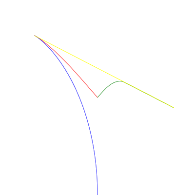

# 问题

二维平面内，所有生物均视为点。两只羊在与狼距离为1的同一点上。
狼的速度是1，羊的速度是0.5.
所有生物同时、连续的移动，瞬时反应。羊和狼的距离为0时会被吃掉。
狼想最小化吃掉两只羊所需的时间，羊想最大化这个时间。
请问它们该怎么移动？狼吃掉两只羊需要多少时间？

原始问题链接: [你先撤，我掩护！两羊一狼问题](https://mp.weixin.qq.com/s/qysNm-VDBbPCL6l3WdtnKA)

# 狼的策略

狼需要在尽量短的时间捉到两只羊.
先追赶距离最近的一只羊, 捉到后再捉另外一只.

# 羊的策略 (贪心)

假定 A 羊距离狼 W 更近一些, B 羊远一些.
则 A 羊选择的方向应该让 $||WA||+||AB||$ 最大化.

$||WA||+||AB||$ 相等的曲线为以 W 和 B 为焦点的椭圆, 所以 A 羊应当选择以 W 和 B 为焦点过 A 点的椭圆的法线方向, 远离 W 和 B.
而椭圆的法线方向即 $\angle WAB$的角分线. 如图:

而 B 羊选择尽量远离 A 羊的方向, 使得 $||AB||$ 最大.

结果如图

另见 [racing.html](./wolf-sheep/racing.html) greedy 策略结果

在时刻 1.775 时狼在坐标 (-0.6824966234801522, 0.5629660456000858) 捉到 A 羊,
此时 B 羊坐标 (0.8119642206777624, -0.04730746482959347), 两羊距离 1.6142636006096867,
总时间 5.003527201219288

实现见 [greedy.js](./wolf-sheep/greedy.js)

# 羊的策略 (抄近路)

如果预先知道 A 羊被捉时 A 羊的位置 (记为 F) 和 B 羊的位置 (记为 G).
则 A 羊应选择使 $||WA||+||AG||$ 最大的方向, 而 B 羊应当尽量选择远离 F 的方向, 同时保证 $||WB|| \le ||WA||$.

结果如图

另见 [racing.html](./wolf-sheep/racing.html) tricky 策略结果

在时刻 1.82 时, 狼在坐标 (-0.6459131471422915, 0.6362020246019914) 捉到羊 A.
此时羊 B 位于 (0.7817926466362477, -0.10550243694239525), 两羊相距 1.6088720713169389
总时间 5.037744142633788

实现见 [tricky.js](./wolf-sheep/tricky.js).
